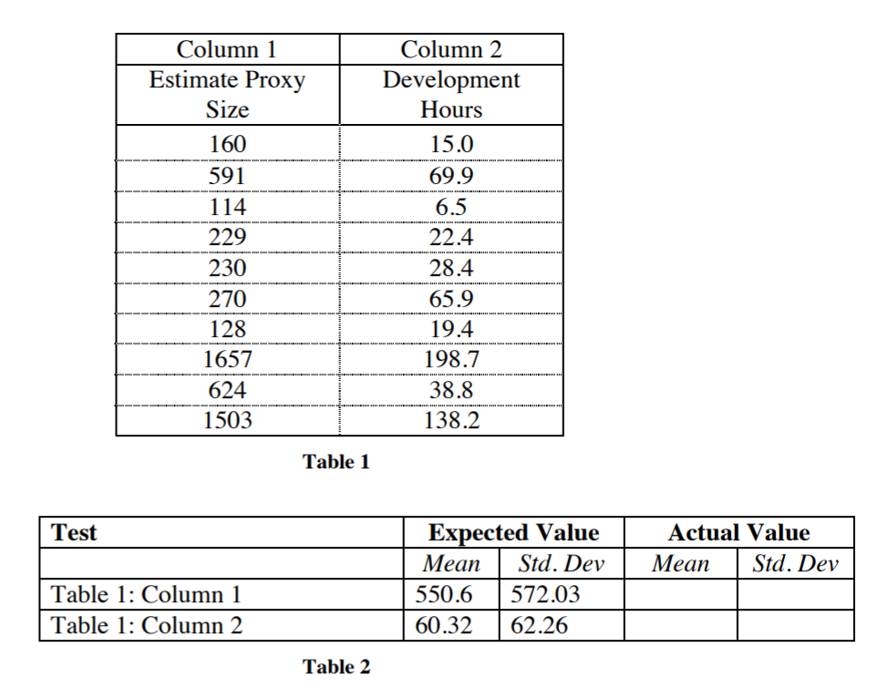
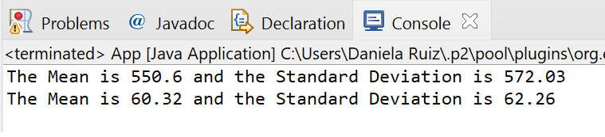

# LABORATORY - INTRODUCTION TO COMPLEX SYSTEMS, JAVA, MVN, AND GIT. 🚀

## Escuela Colombiana de Ingeniería - Enterprise Architectures(AREP).

_Stadistic Calculator: a program that serve for calculate the mean and standard deviation of a set of n real numbers inside a file._

## Getting Started

### Prerequisites

- [Maven](https://maven.apache.org/) - Dependency Management.

- [Java 8](https://www.oracle.com/co/java/technologies/javase/javase-jdk8-downloads.html) -  Development Environment.

- [Git](https://git-scm.com/) - Version Control System.

Make sure you have this programs installed correctly and the version that we need with the following commands:

```
mvn --version
```

```
git --version
```

```
java -showversion
```

### Installing

1. Clone the repository:

```
git clone https://github.com/juancamilo399/Taller1Arep.git
```

2. Compile the projet:

```
mvn package
```

3. Executing the program:

```
mvn exec:java -D "exec.mainClass"="edu.escuelaing.arep.app.App"
```

4. Generating the documentation:

```
mvn javadoc:javadoc
```

- [View Documentation Ubication](https://angiedanielar.github.io/LAB1_AREP/apidocs)

## Running the unit tests

```
mvn test
```

## Test Data

In this laboratory we have test cases along with their respective mean and standard deviation. This information is in the two following tables that have the test data and the expected results.



The following are the results obtained:



Analyzing the results obtained we can see that correspond to the information stored in the previous tables and how there are equal to the expected we can conclude the program behaves correctly when making the different calculations.

## Built With

- [Maven](https://maven.apache.org/) - Dependency Management

- [Java 8](https://www.oracle.com/co/java/technologies/javase/javase-jdk8-downloads.html) -  Development Environment.

- [Git](https://git-scm.com/) - Version Control System.

- [CircleCI](https://circleci.com/) [](https://app.circleci.com/pipelines/github/angiedanielar/LAB1_AREP) - Continuous Integration.

## Inform

- [View the Design Inform](https://github.com/juancamilo399/Taller1Arep/blob/master/resources/Inform.pdf)

## Author

- Angie Daniela Ruiz Alfonso.


## License

This project is under GNU General Public License - see the [LICENSE](LICENSE) file for details.


